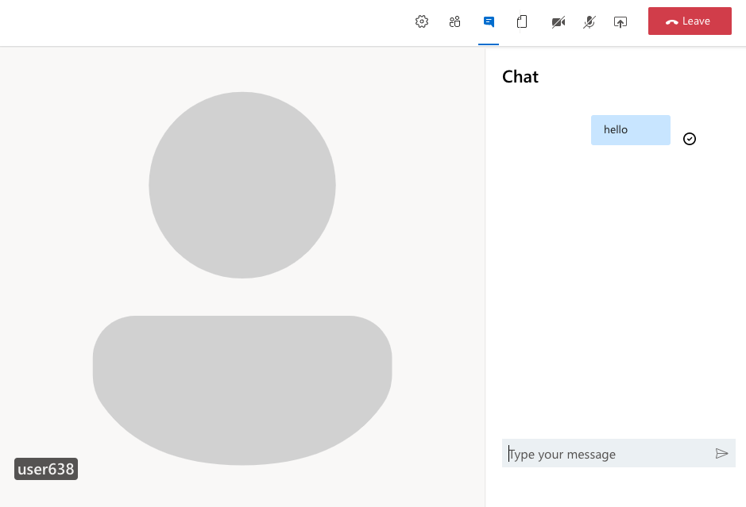

[](https://portal.azure.com/#create/Microsoft.Template/uri/https%3A%2F%2Fraw.githubusercontent.com%2FAzure-Samples%2Fcommunication-services-web-calling-hero%2Fmain%2Fdeploy%2Fazuredeploy.json)

# Group Calling Sample

This is a sample application to show how the ACS Calling Web SDK can be used to build a group calling experience. 
The client-side application is a React based user interface which uses Redux for handling complex state while leveraging Microsoft Fluent UI. 
Powering this front-end is a TypeScript web API powered by Node/Express to connect this application with Azure Communication Services.

The sample has been extended to include file sharing capabilities between meeting participants.

Additional documentation for this sample can be found on [Microsoft Docs](https://docs.microsoft.com/azure/communication-services/samples/calling-hero-sample).



## Prerequisites

- Create an Azure account with an active subscription. For details, see [Create an account for free](https://azure.microsoft.com/free/?WT.mc_id=A261C142F)
- [Node.js (12.18.4 and above)](https://nodejs.org/en/download/)
- Create an Azure Communication Services resource. For details, see [Create an Azure Communication Resource](https://docs.microsoft.com/azure/communication-services/quickstarts/create-communication-resource). You'll need to record your resource **connection string** for this quickstart.
- Create an Azure Storage Account (general purpose v2) resource. You'll need to record your resource **connection string** for this quickstart.

## Code structure

- ./Calling/ClientApp: frontend client
	- ./Calling/ClientApp/src
		- ./Calling/ClientApp/src/Components : React components to help build the client app calling experience
		- ./Calling/ClientApp/src/Containers : Connects the redux functionality to the React components
		- ./Calling/ClientApp/src/Core : Containers a redux wrapper around the ACS Web Calling SDK
	- ./ClientApp/src/index.js : Entry point for the client app
- ./Calling/NodeApi : Backend API for client app to get a token to use with the ACS Web Calling SDK, as well as the file APIs
	- ./Calling/NodeApi/index.ts: Entry point for the API

## Before running the sample for the first time
1. Open an instance of PowerShell, Windows Terminal, Command Prompt or equivalent and navigate to the directory that you'd like to clone the sample to.
2. `git clone https://github.com/Azure-Samples/communication-services-web-calling-hero.git`
3. Get the `Connection String` from the Azure portal for the ACS resource. For more information on connection strings, see [Create an Azure Communication Resources](https://docs.microsoft.com/azure/communication-services/quickstarts/create-communication-resource)
4. Get the `Connection String` from the Azure portal for the Azure Storage resource.
5. Create a `.env` file in `./Calling/NodeApi` with the following keys and fill in the values from your ACS and Storage connection strings:
	```
	ACS_CONNECTION_STRING=
	STORAGE_CONNECTION_STRING=
	```

## Locally running the sample app

1. Go to the `./Calling/NodeApi` folder and run `npm install` followed by `npm run watch`.
2. Go to the `./Calling/ClientApp` folder and run `npm install` followed by `npm run start`.
3. Open a browser to `localhost:3000`

## Debug the front end
Using the [launch.json](.vscode/launch.json) file, you can debug the front-end code with Chrome.

1. Launch Chrome `/Applications/Google\ Chrome.app/Contents/MacOS/Google\ Chrome --remote-debugging-port=9222`
2. On VS Code Click Run > Start Debugging 

### Troubleshooting

N/A

## Publish to Azure

N/A

## Additional Reading

- [Azure Communication Calling SDK](https://docs.microsoft.com/azure/communication-services/concepts/voice-video-calling/calling-sdk-features) - To learn more about the calling web sdk
- [Redux](https://redux.js.org/) - Client-side state management
- [FluentUI](https://developer.microsoft.com/en-us/fluentui#/) - Microsoft powered UI library
- [React](https://reactjs.org/) - Library for building user interfaces